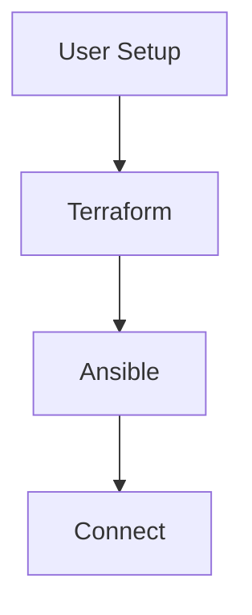

### Overveiw
This git hub contains the needed the need files for setting up a minecraft server through AWS. The main files that are needed in this process will be Main.tf which sets up the ec2 instance and also the Minecraft_setup.yml file for congiuring the minecraft server. The other files will be genterated as you run some of the commands listed below. THe process is largly automated so there will only be a few commands that will be needed.

### Needed Tools

- **Terraform** (version 1.0+)
  - Installation:
    - macOS:`brew tap hashicorp/tap && brew install hashicorp/tap/terraform`.
    - Windows: Download from [Terraform Downloads](https://www.terraform.io/downloads.html).
    - Linux: Use the package manager or download from [Terraform Downloads](https://www.terraform.io/downloads.html).

- **Ansible** (version 2.9+)
  - Installation:
    - macOS: `brew install ansible`.
    - Windows: Use WSL and follow Linux instructions.
    - Linux: `sudo apt update && sudo apt install ansible`.

- **AWS CLI** (version 2)
  - Installation:
    - macOS: `brew install awscli`.
    - Windows: Download from [AWS CLI Installer](https://docs.aws.amazon.com/cli/latest/userguide/getting-started-install.html).
    - Linux: `sudo apt install awscli`.
  - Configure: `aws configure`.

- **Docker**
  - Installation:
    - Windows and macOS: Download and install from [Docker Desktop](https://www.docker.com/products/docker-desktop).
    - Linux: Use the package manager: `sudo apt update && sudo apt install docker.io`.

### Configuration

- AWS Credentials: Configure your AWS CLI with valid credentials using `aws configure`.
- Ensure SSH Key Permissions: Set the correct permissions for the SSH private key: `chmod 400 terraform/minecraft-key.pem`.

## Diagram of the Major Steps in the Pipeline
  -First all the depencies need to be downloaded after that the terrraform script can be ran to set up the ec2 instance. Following the succesful setup of the ec2 instance the playbook can be ran to configure the minecraft server. Once the server is configured all there is left to do is to connect.


### Pipeline steps exaplianed/Needed commands
**Setup:** 
Like in the diagram above the fist step is going to be ensureing that you have all the nessery dependenices downloaded onto your machine.
These dependenices can be found above with links for macOS, windows, and linux. Follow the links and download the one corrisponding to your 
machine. For awsCLI you are also going to need to configure it. This can be done via the aws configure command.
```sh
    aws configure
```
You will be asked a string of questions that can be filled in through the aws details tab on the aws client. You can also just open the credentials file through vim useing the following command.
```sh
    vim ~/.aws/credentials
```
Once the dependinces are downloaded you can copy the files in the directoy to your local machine to be used in the following steps.

**Terraform:**
First we need to make an ec2 instance which can be done through the provisioning script in the file Main.tf. First open a terminal
and use the cd command to get into the "Terraform" folder. Once you are in the folder yur are then going to run.
```sh
    terraform init
```
This command initalizes the working directory containing the terraform configuration files. After that we are going to run the following command from the same terminal.
```sh
    terraform apply
```
The "terraform apply" command is going to apply the configuration sprict and create the ec2 instance with the correct configureations. After framework is made the ec2 instance will be running which brings us to the next step

**Ansible(Minecraft server setup):** 
Now that the ec2 instance is running we now just need to setup and configure the minecraft server. The server will be run useing docker with a docker image, the ansible script will download the needed dependences. To run the playbook your are going to perform the following command from the terraform folder that you should curently be in.
```sh
    ansible-playbook -i inventory.ini Minecraft_setup.yml
```
After that command is ran you should be able to see all the section being setup through the terminal, once it is finished and you have access to the terminal you should be able to access the server.

**Accessing the server:**
Now that the server is up and running you can check it through two methods the first one will be through minecraft client itself or if you just want to check if the server is running "nmap" can be used.

-Minecraft Client: You need to first open your minecraft client and then go to multiplayer section. You can then click the add server option, enter the server infor, and then enter the inforamtion and connect.
-Namp: If your goal is to just check the server status you can use the following command
```sh
    nmap -sV -Pn -p T:25565 34.223.226.154
```
NOTE: You need to change the ip address to the one that your ec2 instance is wrong one, the one in the command is a example.
### Resources
This tutorial was largly base off the information and examples that can be found in the links below. All these links to a fantasic job explaining and showing how to build terraform and ansible scripts. 
#### Ansible:
- [Ansible User Module](https://docs.ansible.com/ansible/latest/collections/ansible/builtin/user_module.html)
- [Docker Minecraft Server](https://docker-minecraft-server.readthedocs.io/en/latest/#using-docker-compose)
- [Ansible Service Module](https://docs.ansible.com/ansible/latest/collections/ansible/builtin/service_module.html)
- [Ansible Yum Module](https://docs.ansible.com/ansible/latest/collections/ansible/builtin/yum_module.html)
- [Ansible Docker Container Module](https://docs.ansible.com/ansible/latest/collections/community/docker/docker_container_module.html)
- [Docker Minecraft Server Examples](https://github.com/itzg/docker-minecraft-server/tree/master/examples)

#### Terraform:
- [Terraform AWS Provider Documentation](https://registry.terraform.io/providers/hashicorp/aws/latest/docs)
- [Terraform EC2 Instance](https://spacelift.io/blog/terraform-ec2-instance)
- [Terraform Internet Gateway Resource](https://registry.terraform.io/providers/hashicorp/aws/latest/docs/resources/internet_gateway)
- [Terraform Route Table Association Resource](https://registry.terraform.io/providers/hashicorp/aws/latest/docs/resources/route_table_association)
